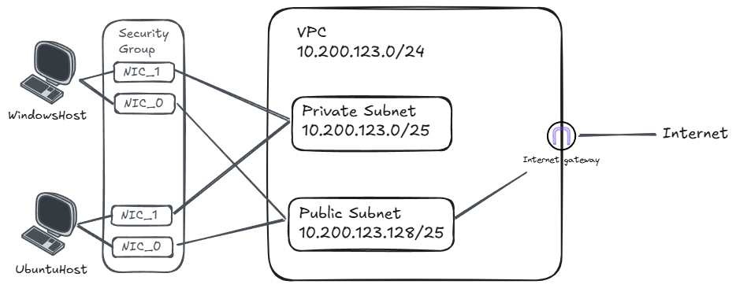

# Notes

## Project file structure
```
.
├── journal/
│   └── week1/
│       └── instances/
│           └── journal.md
└── projects/
    └── week1/
        └── instances/
            ├── instances.json  # CloudFormation template parameter
            └── instances.yaml  # Cloudformation template
```

## Usage
- Change working directory to `/project`
- Run `make instances` to setup the hosts, which deploys:
  - A PEM keypair (since I'm using WSL, so I don't need the PPK kaypair)
  - A general security group
  - A ubuntu host, with a public NIC
  - A windows server host, with a public NIC
  - Two private NICs attached to windows and ubuntu machine

## Instances resource map


# Things learned

## Security group and NIC
As mentioned in the video lecture, security group applies to the NIC level. In the CloudFormation template, this means you need to **attach security group when creating the network interface** of the instance, as mentioned in the documentation:
```text
GroupSet
The IDs of the security groups for the network interface. Applies only if creating a network interface when launching an instance.
```
I encountered an error when I create network interface without specifying a security group set, so it has to be there when we create the NIC.

## Public IP assignment
I got the error of `The associatePublicIPAddress parameter cannot be specified when launching with multiple network interfaces` when trying to create windows instance using below template:
```yaml
WindowsEc2Instance:
  Type: AWS::EC2::Instance
  Properties:
    ...
    NetworkInterfaces:
      - DeleteOnTermination: true
        AssociatePublicIpAddress: true  # This causes the error
        DeviceIndex: "0"
        SubnetId: !Ref PublicSubnetId
        GroupSet:
          - !Ref SecurityGroupGeneral
      - DeleteOnTermination: true
        DeviceIndex: "1"
        SubnetId: !Ref PrivateSubnetId
        GroupSet:
          - !Ref SecurityGroupGeneral
    ...
```
I have to create the private NIC and associate it with the instance manually, which solves the issue.

## PEM keypair using CloudFormation
In the video, Tim download the private key file directly after creating the key pair. This is not the case when creating key pairs using CloudFormation template, which will create a secure string in the parameter store, and we need to manually download the content from there.
