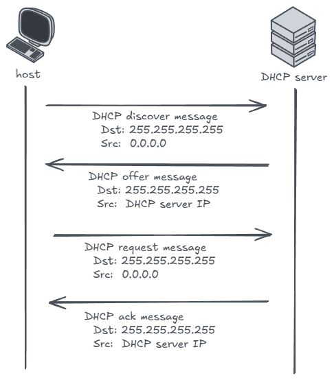
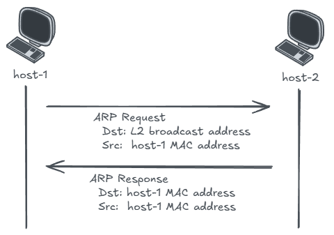
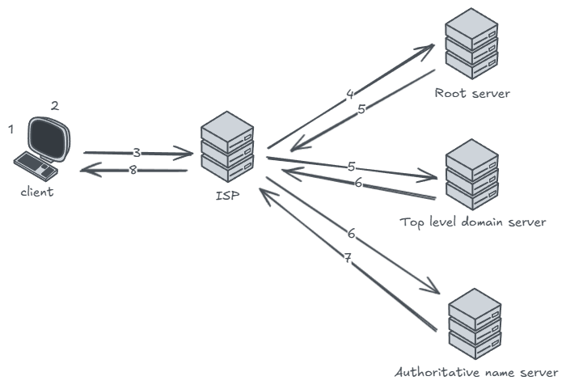
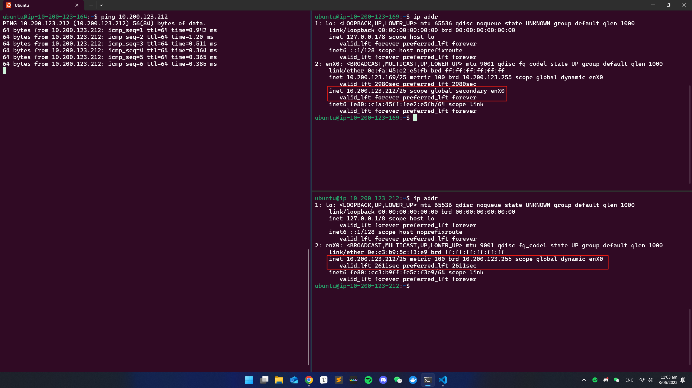
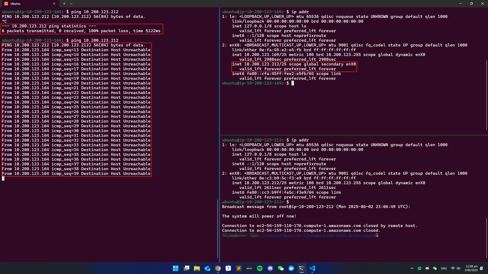
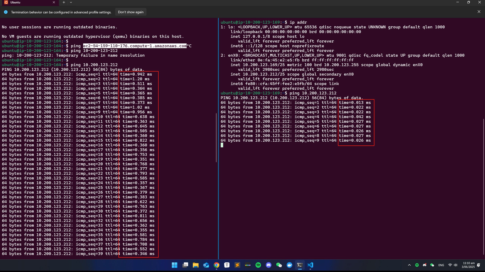

# Notes

## Protocol review

### DHCP protocol (dynamic host configuration protocol)

There are two ways that a computer can be assigned an IP address, and DHCP solves scalability issue to assign IP addresses
- Static IP: user assigns an IP address **manually**, and provide below four informations:
    - IP address
    - Subnet mask (indicates the network address)
    - Default gateway (indicates how packet leave the local network)
    - DNS server (provide host to IP mapping)
- Dynamic IP: host get IP address from a DHCP automatically (starts by sending a `DHCPDISCOVER` message), DHCP server also provides the extra informations

Each DHCP has a scope of IP addresses that it can be used to assign to hosts. The DHCP server assigns the IP address as a lease, which indicates for how long the host can use the assigned IP address. One the lease expires, the assigned IP address will be returned to the pool to be reused. In onprem scenarios, servers probably won't need DHCP since you are likely want your web server to stay static.

DHCP message flow:



### ARP protocol (address resolution protocol)

Address resolution protocol is used for communications within the same network. ARP is a mapping of L3 address to L2 address. Usually it means an IP address to MAC address mapping (a known IP address to an unknown MAC address)

ARP message flow:



### DNS protocol (domain name system)

DNS resolves a domain name to IP address, which works following the flow in below figure:



1. User typing domain name
2. Local DNS server try to find cached matching record
3. If not found, then local DNS server send query to resolver server (e.g. ISP)
4. If not found, then resolver server send query to the root server
5. The root server direct resolver to top level domain server
6. The TLD server direct resolver to authoritative name server
7. The ANS resolves resource IP address and return it back to resolver (resolver will cache the IP)
8. Resolver returns the IP address back to the client

## `ipconfig` output

I'm trying to understand more of the WSL network related output from `ipconfig` and how the two networks (windows side and WSL side) works with each other

Output from windows host:
```text
Ethernet adapter vEthernet (WSL (Hyper-V firewall)):

   Connection-specific DNS Suffix  . :
   Description . . . . . . . . . . . : Hyper-V Virtual Ethernet Adapter
   Physical Address. . . . . . . . . : 00-15-5D-47-EF-35
   DHCP Enabled. . . . . . . . . . . : No
   Autoconfiguration Enabled . . . . : Yes
   Link-local IPv6 Address . . . . . : fe80::2358:c671:cbce:b5de%54(Preferred)
   IPv4 Address. . . . . . . . . . . : 172.24.208.1(Preferred)
   Subnet Mask . . . . . . . . . . . : 255.255.240.0
   Default Gateway . . . . . . . . . :
   DHCPv6 IAID . . . . . . . . . . . : 905975133
   DHCPv6 Client DUID. . . . . . . . : 00-01-00-01-27-93-F0-FB-04-0E-3C-3B-52-EB
   NetBIOS over Tcpip. . . . . . . . : Enabled
```

Output from WSL:
```text
# ip address
2: eth0: <BROADCAST,MULTICAST,UP,LOWER_UP> mtu 1500 qdisc mq state UP group default qlen 1000
    link/ether 00:15:5d:86:2e:1f brd ff:ff:ff:ff:ff:ff
    inet 172.24.213.227/20 brd 172.24.223.255 scope global eth0
       valid_lft forever preferred_lft forever
    inet6 fe80::215:5dff:fe86:2e1f/64 scope link
       valid_lft forever preferred_lft forever

# ip route
default via 172.24.208.1 dev eth0 proto kernel
172.24.208.0/20 dev eth0 proto kernel scope link src 172.24.213.227
```

Some points to be noted:
1. Why the WSL vEthernet has DHCP disabled, and how the DHCP works with WSL2?

    - The IP (`172.24.208.1`) is statically assigned by Windows, this is the host side of the vEthernet adapter. Windows configure it as part of creating the network bridge, so there is no DHCP lease request or renewal process
    - The WSL VM gets a private IP via internal DHCP, this is managed within Hyper-V, not by the windows DHCP client
    - As can be seen from the route table of the WSL VM:
        - both addresses (`172.24.208.1` and `172.24.213.227`) are in the same `/20` subnet
        - when the WSL 2 instance starts, it requests an IP via DHCP on `eth0`

2. How the internet access from WSL VM routed?

    As can be seen from the WSL VM route table, all internet-bound traffic also goes through the default gateway `eth0` as well, which seems like the windows side vEthernet `172.24.208.1` is acting as a router/NAT gateway for WSL VM

4. IP conflict using `sudo ip addr add` command and aws subnet ip pool

    I tried to set up an IP conflict using this command, with below setup:
    - client host: `10.200.123.164`
    - host A: `10.200.123.169`
    - host B: `10.200.123.212`
    
    and manully configured host A with `10.200.123.212` using the `sudo ip addr add` command, and I noticed below behaviour:

    - Ping `10.200.123.212` works Ok from the client host
    

    - Ping `10.200.123.212` doesn't work from client host if I stop host B
    

    - Ping `10.200.123.212` works Ok from host A
    

    - The ARP table in the client host seems to map the ip correctly to host B, while host A doesn't have `10.200.123.212` mapping in its ARP table
    

    Looks like the manually configured IP address doesn't work outside of the host itself.
