# DHCP protocol

## DHCPDISCOVER
At this stage, `PC0` is ready to send a DHCPDISCOVER message

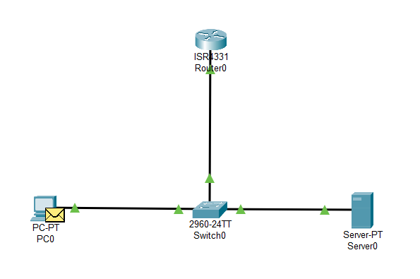

The packet is sent from the address of `0.0.0.0` to `255.255.255.255` for broadcasting, because `PC0` doesn't have a valid IP address at the moment, this can be seen from the IP header

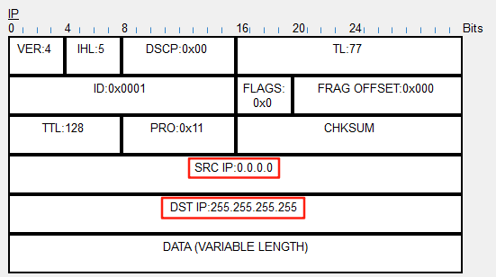

The DHCP service is hosted on server port `67` and client port `68`, which can be seen from the transport layer header. Also the protocol is running through UDP

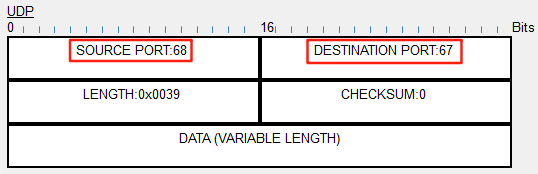

Client has no information about any IP address knowledge at this moment, which can be seen from the DHCP payload

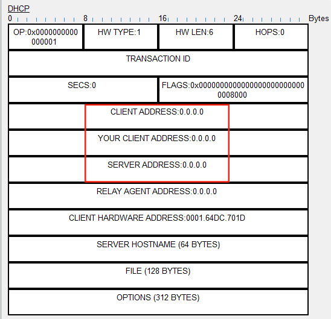

This packet is broadcasted to both `Server0` and `Router0`, but `Router0` will drop the packet because there is no application running on port 67 to provide DHCP service

## DHCPOFFER
At this stage, `Server0` has replied with a DHCPOFFER message

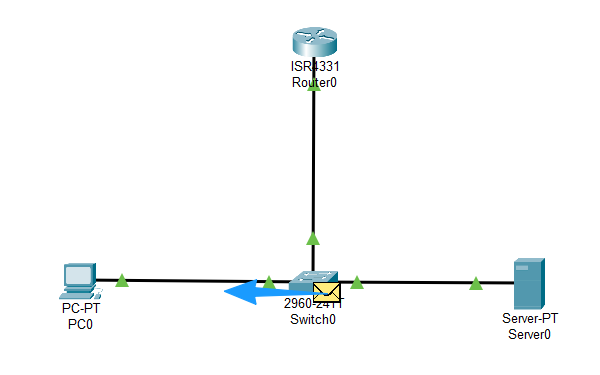

Because `Server0` is aware of its own IP address, thus the packet is sent with the server's source IP address. But since `PC0` is not assigned with an IP address yet, thus the destination IP is still the broadcast IP address

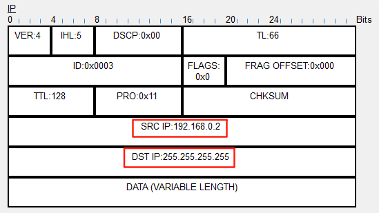

Now from the transport layer header, we can see the port number has swapped

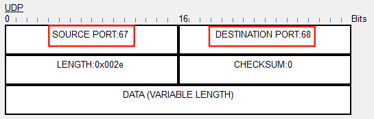

From the DHCP payload, we can see the server has filled in some information, includes the server's IP address, and the offered IP address (notice this is a different field than `CLIENT ADDRESS`)

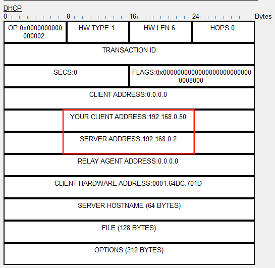

## DHCPREQUEST

At this stage, `PC0` is ready to request the offered IP address

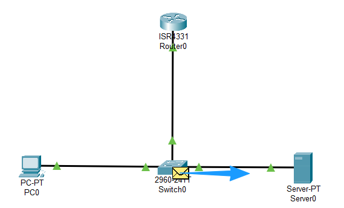

Again, this packet is sent from the `0.0.0.0` source address to `255.255.255.255` for broadcasting, which can be seen at the packet's ip header

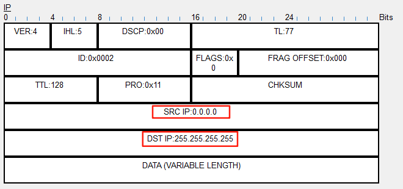

There is a question at this stage though: why does `PC0` still use broadcast ip as its destination? It should be aware of the server's IP address at this point, it could have send to the server directly. The answer has to do with:
- Multiple DHCP servers can provide DHCP service at the same time in the same network. Broadcasting can inform other DHCP servers (if there is one) which IP the client is requesting now
- The client's network layer may not fully initialized yet

There might be other reasons, but essentially, broadcast is utilized at this stage

Other informations at transport and application layer at this point doesn't has too much difference compare to DHCPOFFER message

## DHCPACK

`Server0` is able to acknowledge the request at this stage

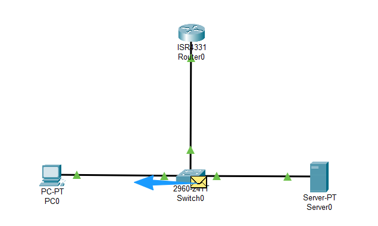

As can be seen, the packet again is broadcasted since the client doesn't have an IP yet at this stage

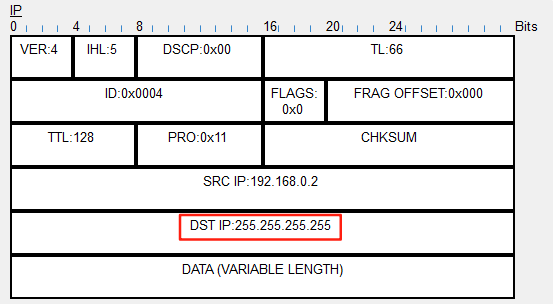

After investigating the DHCPACK payload, we can see the `CLIENT ADDRESS` is again `0.0.0.0`, which seems a bit weird to me

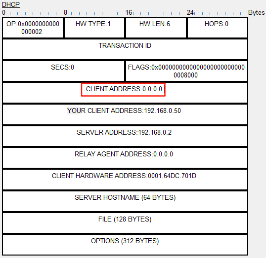

After some reading, I found that acccording to [RFC2131](https://www.ietf.org/rfc/rfc2131.txt#:~:text=ciaddr%20%20%20%20%20%20%20%204%20%20Client%20IP%20address%3B%20only%20filled%20in%20if%20client%20is%20in%0A%20%20%20%20%20%20%20%20%20%20%20%20%20%20%20%20%20%20%20%20BOUND%2C%20RENEW%20or%20REBINDING%20state%20and%20can%20respond%0A%20%20%20%20%20%20%20%20%20%20%20%20%20%20%20%20%20%20%20%20to%20ARP%20requests.), seems this field only used when the client already has a valid IP address, such as during renewal. It stays 0.0.0.0 during initial discovery and allocation phases.
