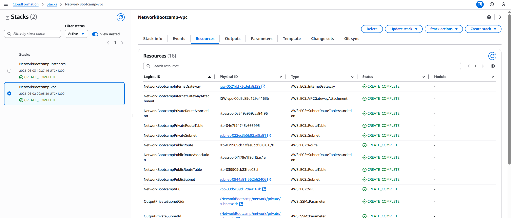
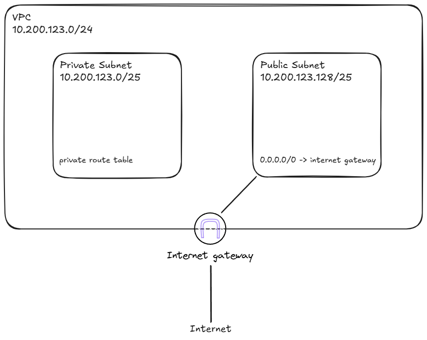

# Notes

The CloudFormation template file is created to facilitate repeatable deployment and easier cleaning after the bootcamp

## Project file structure
```
.
├── journal/
│   └── week1/
│       └── vpc/
│           └── journal.md
└── projects/
    └── week1/
        └── vpc/
            ├── vpc.json  # CloudFormation template parameter
            └── vpc.yaml  # Cloudformation template
```

## Usage
- Change working directory to `/project`
- Run `make vpc` to setup the vpc infrastructure, which deploys:
    - A VPC with cidr `10.200.123.0/24` according to the video instruction
    - A public subnet with `/25` size
    - A private subnet with `/25` size
    - An internet gateway
    - A route table with `0.0.0.0/0` routes to the internet gateway
    - Attach the internet gateway with the created VPC
    - Attach the public route table with the public subnet

After deployment, you should have the instances stack created:


## VPC resource map


# Things learned

## Resource dependency
When creating `AWS::EC2::Route` for the public subnet, it looks important to add `dependsOn` as below. Otherwise I encountered some error complaining that the route table is not in the same network as the internet gateway, which looks like a timing issue
    ```yaml
    NetworkBootcampPublicRoute:
        Type: AWS::EC2::Route
        DependsOn:
            - NetworkBootcampInternetGatewayAttachment
    ...
    ```

## CIDR size
When creating subnet of `/25` size within the `10.200.123.0/24` cidr block, I realized there can only be two subnets created max, because we only use one bit to seperate the entire network range