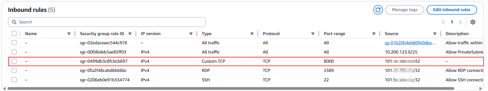
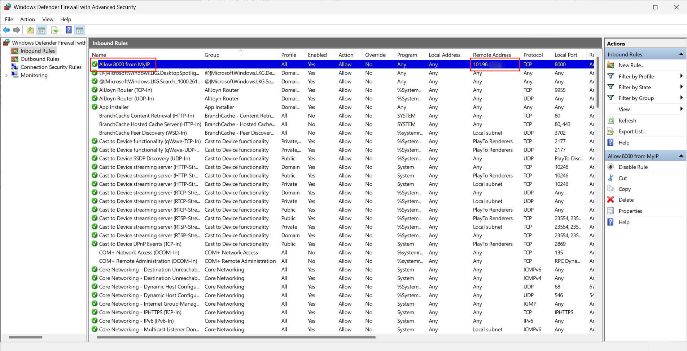
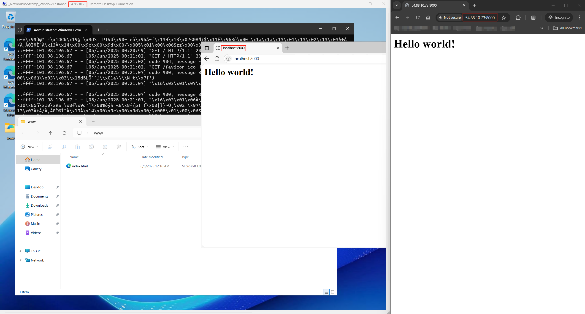

# Proof of work

## Environment prepare

I downloaded python to the AWS windows instance setup earlier, and configured the security group to allow `8000` port inbound traffic as below:

Rather than add an allow rule for all remote addresses, I specifically added my `/32` IP address I get from local:

## Connection

Once I done the configuration, I was able to visit the web page hosted on the remote windows instance, as can be seen below. It shows the web page is reachable from both the windows instance localhost and also from my local environment

